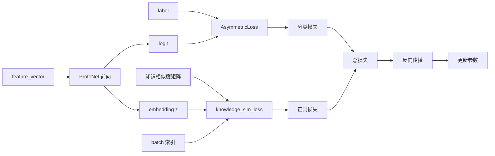
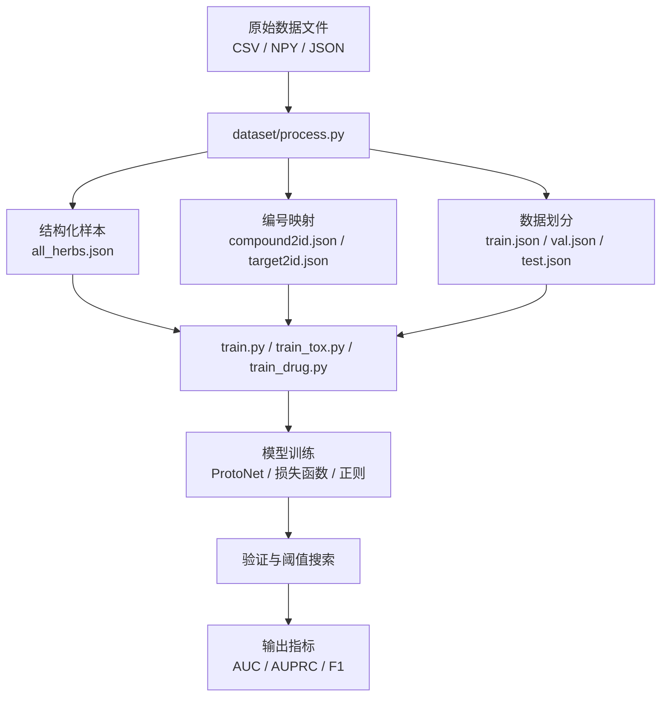
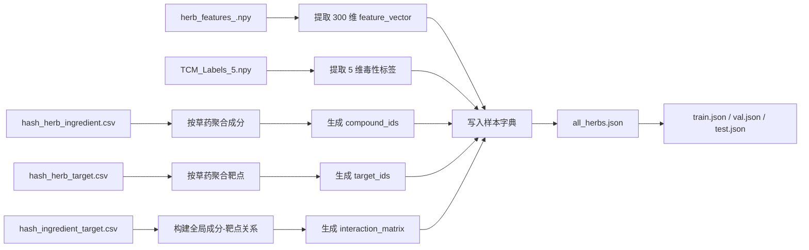
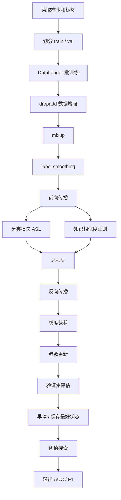

# 项目总览

这份文档面向刚接触代码的人，用来快速理解这个仓库里有哪些模块、每个模块做什么、数据怎么流动、模型怎么训练，以及最终输出什么结果。

## 1. 这个项目在做什么

这个项目的目标是：根据草药或药物的特征信息，预测它们的毒性标签。

仓库里实际上有三条主线：

1. 草药主任务：5 个毒性标签，多标签分类。
2. 肝毒性任务：单标签二分类。
3. 西药毒性任务：8 个毒性标签，多标签分类。

它们共用同一个核心模型思路：

- 先把输入特征编码成中间表示。
- 再用 prototype 的方式做二分类输出。
- 训练时配合不平衡分类损失、数据增强、知识相似度正则、交叉验证。

## 2. 模块清单

下面是仓库里的主要模块，以及它们的职责。

### 2.1 dataset/process.py

作用：把原始数据整理成训练可直接使用的结构化文件。

它最重要的职责是把“原始关系数据”变成“每个草药一条样本”的 JSON 格式。可以把它理解成一个数据加工流水线。

它的输入文件和输出文件分别如下。

输入文件：

- hash_herb_ingredient.csv：草药-成分对应关系。
- hash_herb_target.csv：草药-靶点对应关系。
- hash_ingredient_target.csv：成分-靶点对应关系，用来构建全局知识图。
- herb_features_.npy：草药的 300 维特征矩阵，每一行对应一个草药。
- TCM_Labels_5.npy：草药的 5 维毒性标签矩阵。
- hash_herb.json：草药名称到编号的映射，用来保证草药顺序对齐。

输出文件：

- compound2id.json：把每个成分映射成一个全局编号。
- target2id.json：把每个靶点映射成一个全局编号。
- all_herbs.json：全量草药样本，后续训练主要读取它。
- train.json：训练集样本。
- val.json：验证集样本。
- test.json：测试集样本。
- statistics.json：统计信息，例如样本数、靶点数、特征维度等。

它做的事情包括：

- 读取草药-成分、草药-靶点、成分-靶点关系文件。
- 读取草药特征矩阵 herb_features_.npy。
- 读取草药毒性标签 TCM_Labels_5.npy。
- 给成分和靶点分配全局编号。
- 为每个草药生成一个样本字典。
- 划分 train / val / test。
- 保存 all_herbs.json、train.json、val.json、test.json、statistics.json。

输出结果的核心格式是：

- herb_name：草药名称
- compound_ids：成分 id 列表
- target_ids：靶点 id 列表
- interaction_matrix：成分-靶点交互矩阵
- feature_ids / feature_vector：草药特征
- label：毒性标签

你可以把一个样本理解成下面这个结构：

```json
{
    "herb_name": "某个草药",
    "compound_ids": [3, 8, 21],
    "target_ids": [5, 12],
    "interaction_matrix": [[1, 0], [0, 1], [1, 1]],
    "feature_ids": [2, 17, 45, 88],
    "feature_vector": [0, 0, 1, 0, 0, 1, ...],
    "label": [1, 0, 0, 1, 0]
}
```

这个例子可以这样理解：

- 这个草药有 3 个成分，所以 compound_ids 长度是 3。
- 这个草药有 2 个靶点，所以 target_ids 长度是 2。
- interaction_matrix 是一个 3 x 2 的小矩阵，表示每个成分和每个靶点之间有没有已知作用。
- feature_vector 是 300 维输入特征，模型训练时主要吃这个。
- label 是 5 维毒性标签，比如某些毒性为 1，某些为 0。

再举一个更直观的人工小例子：

- 假设草药 A 有成分 c1、c2，靶点 t1、t2。
- 假设 c1 会作用于 t1，c2 会作用于 t2。
- 那么 process.py 会把它整理成：

```json
{
    "herb_name": "草药A",
    "compound_ids": [0, 1],
    "target_ids": [7, 9],
    "interaction_matrix": [[1, 0], [0, 1]],
    "feature_ids": [4, 11, 27],
    "feature_vector": [0, 0, 0, 0, 1, 0, ...],
    "label": [0, 1, 0, 0, 1]
}
```

这一步的核心目的不是直接训练模型，而是把零散的关系表变成“每个草药一条完整样本”。后面的训练脚本才能统一读取、统一划分、统一建模。

### 2.2 model.py

作用：定义所有神经网络结构和损失函数。

这个文件不是“一个模型”，而是一个模型工具箱。里面同时放了：

- 编码骨干网络。
- 主分类模型。
- 可选的双视角实验模型。
- 可选的对比学习损失。
- 知识正则。
- 不平衡分类损失。

真正被主训练脚本广泛使用的是这些：

- [ProtoNet](herd_backend/model.py) ：主分类模型。
- [AsymmetricLoss](herd_backend/model.py) ：分类损失。
- [knowledge_sim_loss](herd_backend/model.py) ：知识相似度正则。

`DualViewModel` 和 `CrossViewLabelConLoss` 目前更像是实验备用件，主脚本里没有作为默认主干直接使用。

#### 2.2.1 各个类分别干什么

`Encoder`

- 输入：原始特征向量，例如草药任务里的 300 维 feature_vector。
- 结构：Linear -> BatchNorm -> ReLU -> Dropout，再接一层 Linear -> BatchNorm -> ReLU -> Dropout。
- 输出：256 维中间表示。
- 作用：把原始稀疏特征压到一个更适合分类和度量学习的空间。

`ProtoNet`

- 输入：一个样本的特征向量。
- 内部流程：先经过 Encoder，再经过 projection 层映射到更低维的 embedding。
- 关键参数：
    - `proto_pos`：正类 prototype。
    - `proto_neg`：负类 prototype。
    - `scale`：相似度差的缩放系数。
- 输出：一个 logit。
- 作用：用“样本 embedding 和正/负 prototype 的相似度差”来做二分类。
- 直观理解：如果一个样本更接近正类 prototype，logit 就更大；更接近负类 prototype，logit 就更小。

`DualViewModel`

- 输入：
    - `feat`：原始草药特征。
    - `know`：知识向量，例如化合物 multihot 或其他知识表示。
- 内部流程：
    - `feat` 走特征编码器。
    - `know` 走知识投影层。
    - 分类头只基于特征视角输出。
- 输出：分类 logit，或者在需要时输出特征/知识两个投影向量。
- 作用：做双视角实验，观察知识视角是否能帮助分类。

`CrossViewLabelConLoss`

- 输入：`z_feat`、`z_know`、`labels`。
- 作用：如果两个样本标签相同，就鼓励它们在特征视角和知识视角上的表示更接近；标签不同则相反。
- 直观理解：这是一个“把同类拉近、异类拉远”的跨视角对比损失。

`knowledge_sim_loss`

- 输入：模型学到的 embedding `z`、知识相似度矩阵 `know_sim_matrix`、当前 batch 的样本索引 `indices`。
- 作用：如果两个草药在知识图里很相似，那么它们的 embedding 也应该更相似。
- 训练里它是一个额外正则项，不是主分类损失。

`AsymmetricLoss`

- 输入：模型输出的 logits 和标签。
- 作用：专门处理正负样本不平衡问题。
- 直观理解：它对负类和正类的惩罚不完全一样，适合这种“正样本更少”的毒性预测任务。

#### 2.2.2 主数据流怎么走

主训练时最常见的数据流是：

1. 先从 [dataset/process.py](herd_backend/dataset/process.py) 生成的 JSON 里取出 `feature_vector` 和 `label`。
2. `feature_vector` 进入 `ProtoNet`。
3. `ProtoNet` 先用 `Encoder` 编码成 256 维表示。
4. 再经过 projection 层，得到更紧凑的 embedding。
5. embedding 与正/负 prototype 做余弦相似度比较。
6. 得到 logit 后，用 `AsymmetricLoss` 计算分类损失。
7. 如果开启知识正则，再用 `knowledge_sim_loss` 约束 embedding 和知识相似度矩阵一致。
8. 最终把分类损失和正则损失加起来，反向传播更新参数。

#### 2.2.3 模型内部结构图

这张图只画 ProtoNet 的主前向传播，也就是一个样本从输入特征到输出概率的路径。

输入特征
    |
    v
Encoder
(300 -> 512 -> 256)
    |
    v
Projection
(256 -> proj_dim)
    |
    v
L2 归一化
    |
    v
样本 embedding z
    |\
    | \
    |  \
    v   v
proto_pos   proto_neg
    |          |
    v          v
sim_pos      sim_neg
        \      /
         v    v
    相似度差值
    sim_pos - sim_neg
             |
             v
         scale 缩放
             |
             v
             logit
             |
             v
          sigmoid
             |
             v
         预测概率

这张图的核心是：

- Encoder 负责把原始特征压到 256 维中间表示。
- Projection 再把表示映射到更适合做 prototype 比较的空间。
- L2 归一化让 embedding 和 prototype 的相似度比较更稳定。
- 正/负 prototype 是模型里直接学习出来的两个参考向量。
- `sim_pos - sim_neg` 这一步决定样本更像正类还是负类。
- `scale` 负责放大这个差值，最后得到 logit，再经过 sigmoid 变成概率。

补充说明：如果调用 `forward(..., return_proj=True)`，模型还会把 `z` 一起返回，供 `knowledge_sim_loss` 使用；但这个分支不改变主前向路径，所以没有画进主图里。

#### 2.2.4 训练时的损失流向图



这张图画的是训练阶段。和上面那张图相比，它多了两个东西：

- `AsymmetricLoss`：负责监督分类。
- `knowledge_sim_loss`：负责把知识结构约束进 embedding。

最后真正优化的是“总损失” = 分类损失 + 正则损失。

#### 2.2.5 训练时到底谁在用谁

- [train.py](herd_backend/train.py) ：主力使用 `ProtoNet`、`AsymmetricLoss`、`knowledge_sim_loss`。
- [train_tox.py](herd_backend/train_tox.py) ：同样使用 `ProtoNet`、`AsymmetricLoss`、`knowledge_sim_loss`，只是任务变成肝毒性二分类。
- [train_drug.py](herd_backend/train_drug.py) ：使用 `ProtoNet` 和 `AsymmetricLoss`，输入换成 1024 维 Morgan 特征。
- [test_knowledge_fusion.py](herd_backend/test_knowledge_fusion.py) ：用不同实验模型比较知识融合方案，不是主线训练。

#### 2.2.6 为什么要这样设计

- `Encoder` 负责把稀疏原始特征变成可学习表示。
- `ProtoNet` 用 prototype 让分类边界更稳定，也更适合小样本/不平衡场景。
- `AsymmetricLoss` 解决标签不平衡。
- `knowledge_sim_loss` 把知识图信息注入 embedding 空间。
- `DualViewModel` 和 `CrossViewLabelConLoss` 提供了另一种知识融合思路，方便做对比实验，但它们不是当前主训练脚本的默认路径。

#### 2.2.7 DualViewModel 什么时候用

DualViewModel 不是在 ProtoNet 的 `forward()` 里面自动运行的。它只会在你显式把它实例化、并在某个实验脚本里调用时才会参与计算。

换句话说，当前仓库的主线是：

```text
训练脚本(train.py / train_tox.py / train_drug.py)
    -> ProtoNet
    -> 分类概率
```

DualViewModel 更像另一条实验线：

```text
输入特征 feat + 知识特征 know
    -> feat_encoder / know_proj
    -> 特征分支输出 logit
    -> 知识分支输出 embedding
    -> 外部损失或对齐实验
```

它的用途通常是：

- 做特征视角和知识视角的对齐实验。
- 看知识向量能不能帮助分类。
- 作为和 ProtoNet 方案的对照组。

简图：

```text
                主线：当前默认训练
feature_vector  --------------------->  ProtoNet  ----------------->  预测概率

                实验线：DualViewModel
feat -------------------------------> feat_encoder -> logit
know -------------------------------> know_proj    -> embedding
                                       (供对齐/融合/对比实验使用)
```

所以你可以这样记：

- ProtoNet 是“当前真正用来做预测”的主模型。
- DualViewModel 是“可选的实验模型”，不会自动插进 ProtoNet 里。
- 如果某个脚本没有显式调用 DualViewModel，那它就不会运行。

### 2.3 train.py

作用：草药主任务训练入口。

特点：

- 读取 dataset/output/all_herbs.json。
- 输入特征是 300 维 feature_vector。
- 标签是 5 维多标签。
- 每个标签单独训练一个 ProtoNet，相当于 5 个独立二分类器。
- 使用知识相似度正则，让模型学到的 embedding 和 compound Jaccard 相似度保持一致。
- 做 5 折交叉验证，输出 AUC、Macro-F1、Micro-F1。

### 2.4 train_tox.py

作用：独立肝毒性二分类训练入口。

特点：

- 读取 dataset/output/all_herbs.json。
- 标签来自 TCM_Labels_Liver.npy。
- 仍然使用 ProtoNet + ASL 框架。
- 支持 ASL 和 BCE 两种损失。
- 支持 AUROC / AUPRC 监控。
- 支持把训练结果追加写入日志文件。

### 2.5 train_drug.py

作用：西药毒性多标签训练入口。

特点：

- 输入特征换成 Drug_Morgan.npy，维度是 1024。
- 标签是 Drug_Labels.npy，维度是 8。
- 训练方式和 train.py 很像，也是每个标签单独训练一个 ProtoNet。
- 使用 5 折交叉验证。

### 2.6 test_knowledge_fusion.py

作用：知识融合消融实验脚本。

它不是主训练流程，而是用来比较不同知识融合方式的效果，例如：

- 直接拼接 compound multihot。
- 拼接 target multihot。
- 拼接 SVD 后的知识向量。
- 双编码器平均输出。
- 知识相似度正则。

这个脚本的目标是回答一个问题：

“哪一种知识融合方式最有效，或者至少掉点最少？”

## 3. 核心数据怎么流动

### 3.1 原始文件层

数据原始输入主要来自 dataset/ 目录：

- hash_herb_ingredient.csv
- hash_herb_target.csv
- hash_ingredient_target.csv
- herb_features_.npy
- TCM_Labels_5.npy
- Drug_Morgan.npy
- Drug_Labels.npy
- TCM_Labels_Liver.npy

### 3.2 预处理层

process.py 会把原始数据加工成统一的 JSON 结构，并保存到 dataset/output/。

### 3.3 训练层

训练脚本会从 dataset/output/all_herbs.json 中读取每个草药的 feature_vector 和知识信息，然后把：

- feature_vector 送进模型。
- compound_ids 用于构造知识相似度矩阵。
- label 用于监督训练。

### 3.4 输出层

训练结束后主要输出的是：

- 每折的 AUC / AUPRC / F1。
- 全部折的均值和标准差。
- 可选的训练日志文件。

当前代码里更偏向实验评估，不是一个“训练完自动导出模型文件并上线”的部署工程。

## 4. 总体流程图



## 5. 数据预处理流程图



## 6. 模型内部结构图

```mermaid
flowchart TD
    X[输入特征\n300 维或 1024 维] --> A[Encoder\nLinear + BN + ReLU + Dropout]
    A --> B[256 维隐表示]
    B --> C[Projection 层]
    C --> D[归一化 embedding z]
    D --> E[正 prototype]
    D --> F[负 prototype]
    E --> G[cosine similarity]
    F --> G
    G --> H[logit = scale × (sim_pos - sim_neg)]
    H --> I[sigmoid]\n概率输出
```

## 7. 训练循环图



## 8. 每个脚本的输入输出

### 8.1 train.py

输入：

- dataset/output/all_herbs.json
- dataset/output/compound2id.json

模型输入：

- 300 维 feature_vector

输出：

- 每个标签的验证概率
- fold 级 AUC / Macro-F1 / Micro-F1
- 5 折均值和标准差

### 8.2 train_tox.py

输入：

- dataset/output/all_herbs.json
- dataset/TCM_Labels_Liver.npy

模型输入：

- 300 维 feature_vector

输出：

- AUROC
- AUPRC
- F1
- 可选 JSONL 训练日志

### 8.3 train_drug.py

输入：

- dataset/Drug_Morgan.npy
- dataset/Drug_Labels.npy

模型输入：

- 1024 维 Morgan 指纹

输出：

- 8 类标签的 macro-AUC
- Macro-F1
- Micro-F1

### 8.4 test_knowledge_fusion.py

输入：

- all_herbs.json
- compound2id.json
- target2id.json

模型输入：

- 原始 300 维特征 + 不同形式的知识表示

输出：

- 不同融合方案的对比指标
- 和 baseline ProtoNet 的差值

## 9. 读代码时最该先盯住的地方

如果你是第一次读，建议优先看这几个位置：

1. [dataset/process.py](herd_backend/dataset/process.py)
2. [model.py](herd_backend/model.py)
3. [train.py](herd_backend/train.py)
4. [train_tox.py](herd_backend/train_tox.py)
5. [train_drug.py](herd_backend/train_drug.py)
6. [test_knowledge_fusion.py](herd_backend/test_knowledge_fusion.py)

## 10. 一个容易误解的点

这个仓库看起来像“知识融合模型”，但从主训练脚本看，真正最核心的信号其实还是 feature_vector。

知识信息更多是作为：

- 相似度正则
- 消融实验对照
- 额外特征拼接

来使用的。也就是说，它更像是在帮模型“补充约束”，而不是完全替代原始特征。

## 11. 简单结论

如果只用一句话概括这个项目：

“它先把草药/药物数据整理成结构化样本，再用 ProtoNet 这种小型二分类器结合不平衡损失和知识正则做多标签毒性预测。”

如果你愿意，我下一步可以把这份文档继续补成“逐文件逐函数讲解版”，或者我可以直接再画一张更细的“train.py 训练细节图”。
